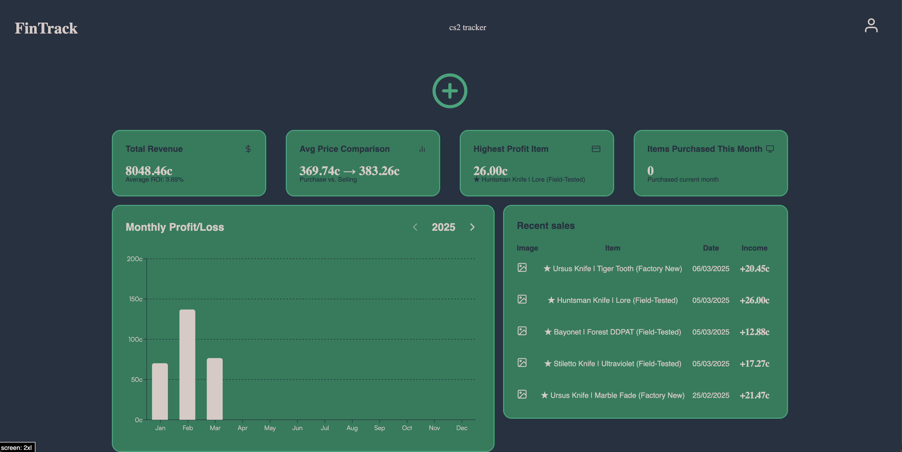

# CS2 Item Tracker

A full-stack web app for Counter-Strike 2 traders. Log every item you buy and sell, and see your profit, losses and trading history on one dashboard.



<!-- TODO: take a screenshot of the Dashboard page and save it as docs/dashboard.png -->

## Features

- **Accounts and auth:** sign up, sign in and log out, with passwords hashed using bcrypt and JWT stored in an HTTP-only cookie
- **Protected routes** on both the API and the frontend (dashboard and profile are only available after signing in)
- **Item management:** add, edit and delete items with buy/sell price, dates and an optional image
- **Soft delete:** deleted items are flagged instead of removed, so history stays consistent
- **Statistics:** profit/loss summaries and charts built with Recharts
- **Seed script** with demo users and sample items for quick testing
- **Responsive UI** with light and dark themes

## Tech stack

| Layer    | Technologies                                                                   |
| -------- | ------------------------------------------------------------------------------ |
| Frontend | React 19, TypeScript, Vite, Tailwind CSS 4, Zustand, Recharts, Radix UI, Axios |
| Backend  | Node.js, Express 5, JWT, bcrypt, cookie-parser                                 |
| Database | MongoDB with Mongoose                                                          |
| Tooling  | ESLint, nodemon                                                                |

## Architecture

```
React + Zustand (browser)
        │  REST / JSON, JWT in HTTP-only cookie
        ▼
Express API (Node.js)
        │  Mongoose
        ▼
MongoDB
```

## Getting started

### Prerequisites

- Node.js 22
- MongoDB (local Community Edition or MongoDB Atlas)

### 1. Clone and configure

```bash
git clone https://github.com/kajetanszlenzak/cs2-item-tracker.git
cd cs2-item-tracker
```

Create a `.env` file in the project root:

```env
MONGO_URI=mongodb://localhost:27017/cs2-item-tracker
JWT_SECRET=your_jwt_secret
```

### 2. Install and build

```bash
npm run build
```

### 3. Run

```bash
# production build: API + frontend served together
npm start
```

The app runs at `http://localhost:5010`.

For development with hot reload, run the API and the frontend in two terminals:

```bash
npm run dev        # backend with nodemon
npm run dev:front  # Vite dev server
```

### 4. (Optional) Load demo data

```bash
npm run seed
```

| User            | Email             | Password     |
| --------------- | ----------------- | ------------ |
| User with items | items@example.com | Password456! |
| Empty account   | demo@example.com  | Password123! |

## API

All `/api/items` and `/api/user` routes require authentication.

| Method | Endpoint                | Description                         |
| ------ | ----------------------- | ----------------------------------- |
| POST   | `/api/auth/signup`      | Create an account                   |
| POST   | `/api/auth/signin`      | Sign in and receive the auth cookie |
| GET    | `/api/auth/logout`      | Log out                             |
| GET    | `/api/auth/verify`      | Check the current session           |
| GET    | `/api/items`            | List the user's items               |
| GET    | `/api/items/all`        | List all items including history    |
| GET    | `/api/items/stats`      | Profit/loss statistics              |
| GET    | `/api/items/:id`        | Get a single item                   |
| POST   | `/api/items/create`     | Add an item                         |
| PUT    | `/api/items/update/:id` | Update an item                      |
| DELETE | `/api/items/delete/:id` | Soft-delete an item                 |
| PUT    | `/api/user/update/:id`  | Update the user profile             |

## Project structure

```
cs2-item-tracker/
├── backend/
│   ├── config/        # database connection
│   ├── controllers/   # auth, user and item logic
│   ├── models/        # Mongoose schemas (User, Item)
│   ├── routes/
│   ├── seeds/         # demo data
│   ├── utils/         # JWT verification, error helpers
│   └── server.js
└── frontend/
    └── src/
        ├── components/
        ├── pages/     # Home, SignIn, SignUp, Dashboard, Profile
        ├── store/     # Zustand stores
        └── utils/
```

Full technical documentation (in Polish), including the data models and ERD, is available in [`documentation.html`](docs/documentation.html).

## Authors

Built by **Kajetan Szlenzak** ([Portfolio](https://kajetanszlenzak.github.io) · [LinkedIn](https://www.linkedin.com/in/kajetan-szlenzak/)) and **Dawid Rubacha**.

## License

MIT
